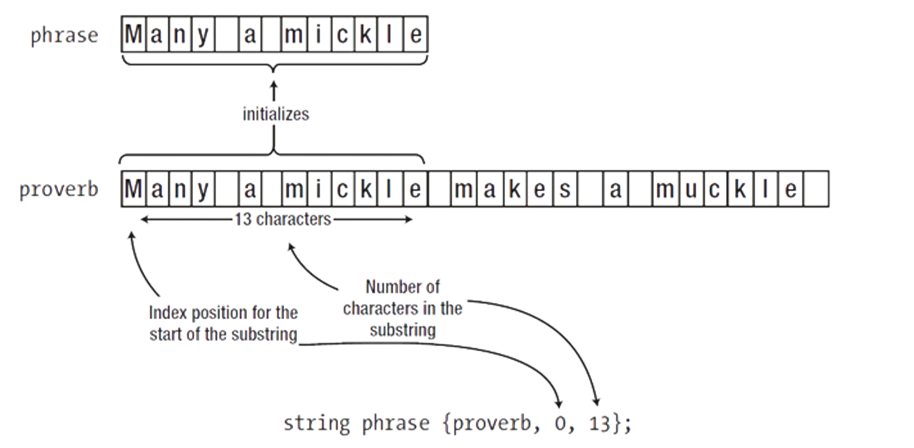

## Getting Started

Trong ngôn ngữ lập trình C++, `std::string` là một kiểu dữ liệu chuỗi được định nghĩa trong thư viện tiêu chuẩn `<string>`. Nó cung cấp một cách linh hoạt và an toàn hơn để làm việc với chuỗi so với chuỗi kiểu C truyền thống.

Trong bài viết này sẽ hướng dẫn bạn qua các bước cơ bản để sử dụng chuỗi trong C++, từ khởi tạo đến thao tác trên chuỗi, và một số kĩ thuật hiện đại với chuỗi.

## Getting Involved

### 1. Khai báo

Để sử dụng thư viện `string`, bạn cần include gói thư viện `string` vào chương trình của mình. Dưới đây là một số cách khai báo thường thấy trong quá trình sử dụng chuỗi.

Lưu ý: Đối với `string`, kí tự cuối cùng của một chuỗi luôn luôn là ký tự `NULL`, kí tự này giúp cho ngôn ngữ lập trình biết được đây là `vị trí kết thúc của chuỗi`. Tuy nhiên ta không thể truy cập được kí tự NULL này và các hàm của lớp string cũng đã xử lý triệt để vấn đề này.


#### 1.1 Khai báo chuỗi rỗng

Để khai báo một chuỗi rỗng trong C++, bạn sử dụng cú pháp sau:

```bash
string name_string;
```

**Giải thích:**

-   std::string: Là lớp chuỗi từ thư viện chuẩn của C++ (string).
-   name_string: Tên của biến chuỗi bạn đang khai báo.
-   Khi bạn khai báo như trên, name_string sẽ được khởi tạo là một chuỗi rỗng, tức là không chứa bất kỳ ký tự nào.

#### 1.2 Khai báo chuỗi có giá trị ban đầu

Để khai báo một chuỗi có giá trị ban đầu trong C++, bạn có thể sử dụng cú pháp sau:

```bash
string name_string {value}
```

**Giải thích:**

-   Trong trường hợp này, name_string sẽ được khởi tạo với giá trị `value`.
-   Chuỗi name_string sẽ có độ dài bằng độ dài của chuỗi `value`, và chứa các ký tự tương ứng.

#### 1.3 Khai báo chuỗi có giới hạn độ dài với giá trị ban đầu

Đôi khi, bạn có thể muốn khai báo một chuỗi có độ dài tối đa (giới hạn số lượng ký tự) và cũng có giá trị ban đầu. Trong C++, bạn có thể làm như sau:

```bash
string name_string {value,max_size};
```

**Giải thích:**

-   name_string: Tên của biến chuỗi.
-   value: Giá trị ban đầu của chuỗi.
-   max_size: Giới hạn số lượng ký tự tối đa mà chuỗi name_string có thể chứa.
-   Khi bạn khai báo như trên, chuỗi name_string sẽ có độ dài tối đa là max_size và được khởi tạo với giá trị `value`.

Nếu độ dài của `value` lớn hơn max_size, chỉ số lượng ký tự đầu tiên của `value` sẽ được sao chép vào name_string.

#### 1.4 Khai báo chuỗi với số lần lặp của một kí tự nào đó

```bash
string name_string (loop_size,char);
```

Tuy nhiên bạn cần lưu với phương pháp khai báo chuỗi với số lần lặp của 1 kí tự nào đó ta cần chú ý những điều quan trọng sau

**1. Giá trị value phải là kí tự**

```c++
string name_string (6,’o’);
```

Với đoạn code bên trên ta có được giá trị hiển thị là

```bash
oooooo
```

**2. Phải sử dụng cặp ngoặc `()`**

```c++
string name_string {111,’z’};
```

Tuy nhiên với đoạn chương trình phía trên kết quả ta mong muốn là `111` chữ `z` tuy nhiên ta lại nhận được kết quả phía bên dưới

```bash
oz
```

Giải thích: Giá trị `111` trong bảng mã Asscii là `o`, nên lúc này `name_string` sẽ có 2 phần tử là `o` và `z`.

#### 1.5 Khai báo chuỗi từ một chuỗi khác

Để khai báo một chuỗi từ một chuỗi khác trong C++, bạn có thể sử dụng cú pháp sau:

```c++
string name_string{other_String};
```

**Giải thích:**

-   name_string: Tên của biến chuỗi mới bạn đang khai báo.
-   other_String: Chuỗi mà bạn muốn sao chép giá trị từ đó vào name_string.

#### 1.6 Khai báo chuỗi từ một chuỗi khác từ vị trí start với number kí tự

```c++
string name_string {other_string,start,number}
```

Dưới đây là ví dụ cho cách hoạt động của việc khai báo từ một chuỗi khác với vị trí bắt đầu và số lượng kí tự của chuỗi mới.



Tuy nhiên có một số trường hợp bàn cần phải lưu ý. Đoạn chương trình bên dưới là một trường hợp rất dễ nhầm lẫn trong quá trình sử dụng.

```c++
#include <iostream>
#include <string>
using namespace std;
int main(){
    string name = "Le Tuan Binh";

    string _pharse{name,5};

    string phrase{"Le Tuan Binh", 5};

    cout<<_pharse<<endl;

    cout<<phrase<<endl;
}
```

Bạn có thể thấy khi thực hiện chương trình trên, nhìn thoáng qua ta nghĩ kết quả của chúng có thể như nhau nhưng thực tế thì kết quả có chút khác biệt. Đây là kết quả hiển thị trên màn hình

```bash
an Binh
Le Tu
```

Thật lạ phải không, để giải thích cho việc này chúng ta hãy xem qua đoạn giải thích bên dưới:

-   Đối với `_pharse`, tham số truyền vào là một chuỗi trong một biến, do đó thực hiện lấy hết kí tự từ vị trí 5 trong chuỗi name.

-   Đối với `phrase`, tham số truyền vào hàm là một chuỗi trực tiếp, do đó thực hiện lấy 5 kí tự đầu tiên trong chuỗi name.
